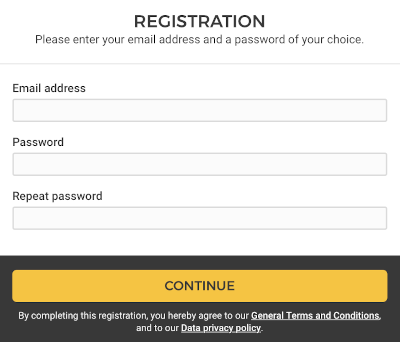
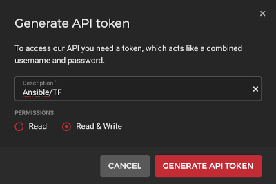
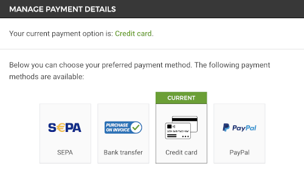
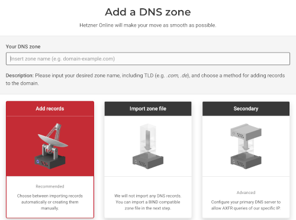
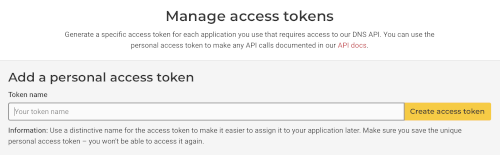

# Covid19 Teststation - Deployment on Kubernetes

This directory provides an easy-to-use scripting to deploy the Covid19 Teststation on a bare-metal [Kubernetes](https://kubernetes.io) cluster.
As infrastructure several virtual servers and other resources will be provisioned on [Hetzner Cloud](https://www.hetzner.com/de/cloud) using [Terraform](https://www.terraform.io):

- **Servers**: at least one virtual server (CX11, 1 vCPU, 2 GB RAM) as Master Node and another one (CX21, 2 vCPUs, 4 GB RAM) as Worker Node.
  We recommend using two Worker Nodes, although a single machine will do the job.
- **Volumes**: Kubernetes will provision just some small persistent volumes using the [HCloud CSI provider](https://github.com/hetznercloud/csi-driver). 
- **Load Balancers**: Traefik will provision an [HCloud Load Balancer](https://github.com/hetznercloud/hcloud-cloud-controller-manager/blob/master/docs/load_balancers.md)
  that forwards HTTPS traffic to the Kubernetes cluster. TLS termination is done by this load balancer, DNS records will point to its ip-address.
- **Networks**: [Cilium](https://cilium.io) is being used as Kubernetes pod network. The [HCloud Controller Manager](https://github.com/hetznercloud/hcloud-cloud-controller-manager/blob/master/docs/deploy_with_networks.md)   
  is configured to use a private host network in the Hetzner Cloud.
  
An HCloud setup like this will cost about 15-20 € per month. Therefore, the costs for running a test system for a just few days will be about 1-2 €.
The [Hetzner DNS Console](https://dns.hetzner.com) service is for free.

To run the application we use the following open-source services:

- **Traefik**: an easy-to-use Ingress Controller, deployed via Helm chart. The installation integrates [External-DNS](https://github.com/kubernetes-sigs/external-dns)
  which provisions DNS records in Hetzner DNS Console as annotated in Traefik Kubernetes Service object. Also Instrumentation using Prometheus and Grafana is configured.
- **Prometheus**: collects metrics from infrastructure and services. Deployed using Helm chart from Prometheus-Operator Kube Stack.
- **Grafana**: also installed by Prometheus-Operator Kube Stack package.
- **Postgres**: full-featured SQL database, the Covid19 Teststation stores appointments information here.

## Prerequisites

Before you can start the deployment please follow these steps to create your Hetzner Cloud account:

### Hetzner Cloud Registration



Register with your email and select a password. New accounts must confirm their emails before first login.
Two-Factor authentication has to be enabled later on and is recommended for security reasons.
New HCloud accounts also have a resource limit but it's enough for your first deployments and can be increased later on.

### Create new HCloud Project


On HCloud access to resources is scoped by projects. Create a new project in the HCloud user interface and select your project from the dashboard.

### Create new HCloud API Token


Navigate to the Security section within HCloud user interface. There's no need to add your SSH key here as this information will be provided by Terraform scripting.



The API token needs to be created with read/write permissions. You can use any name/description but the API token will only be shown at creation time.
Copy your API token and store it somewhere on your computer e.g. using a safe password store.

### Add Payment Method to Hetzner Cloud Account



Before you can continue and use your HCloud account you need to add a payment method.

### Add DNS Zone to Hetzner DNS Console



To get this deployment up and running you need to configure a DNS zone for use with Hetzner DNS Console. This service provides a free
primary and secondary name server which can be controlled programmatically. The domain needs to be switch completely as HCloud does not support DNS sub zones.
Existing DNS entries may be migrated automatically by Hetzner DNS Console. Please follow the instructions on the Hetzner website.


If the migration to Hetzner DNS Console was successful you can use your domain for the deployment of Covid19 Teststation.

### Create new Hetzner DNS Console API Token



Create and save a new Hetzner DNS Console token. You will need this secret to enable External-DNS to create automatically DNS records.

## Configure Infrastructure ENV

### HCloud Credentials for Ansible

Copy `env/credentials.yaml.sample` as `env/credentials.yaml` and add the missing information:

...
...
...

### Application Setup


```bash
ansible-galaxy collection install community.kubernetes
ansible-galaxy collection install hetzner.hcloud

ansible-playbook create-hcloud-infrastructure.yaml  -e "state=present"
ansible-playbook create-kubernetes-cluster.yaml -i env/inventory --private-key ~/.ssh/talexdev_rsa
ansible-playbook deploy-db-prometheus.yaml
ansible-playbook deploy-db-pg.yaml
ansible-playbook deploy-app-termine.yaml
ansible-playbook deploy-ingress.yaml
```

install: htpasswd, openssl
